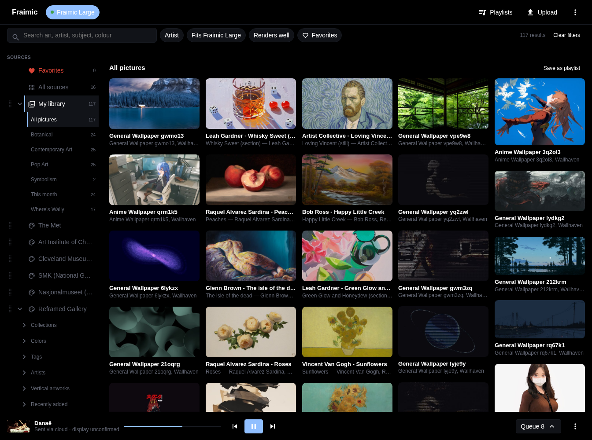
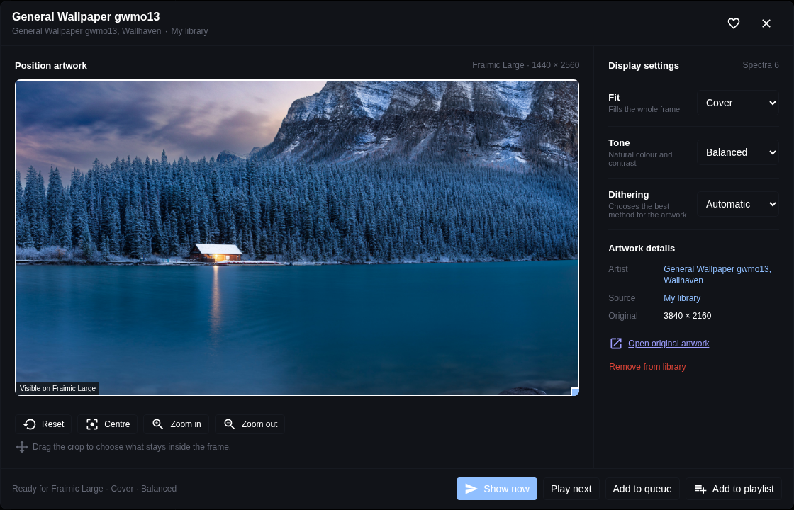
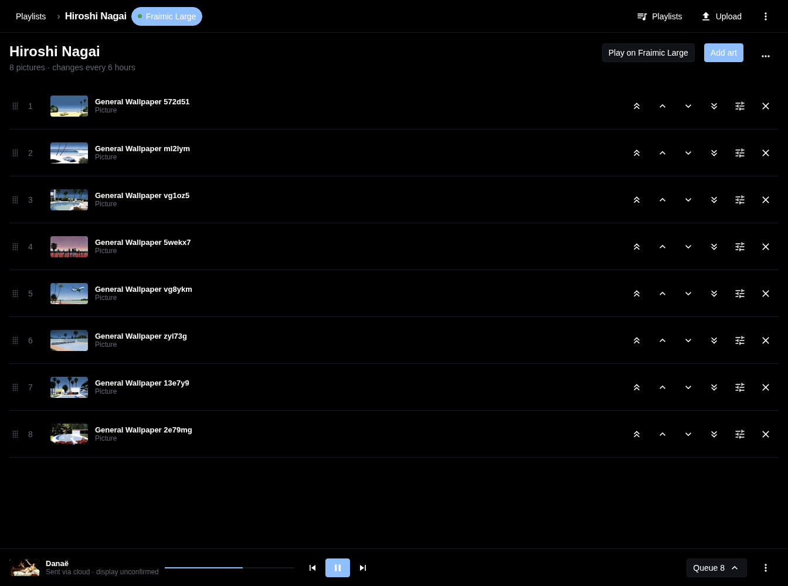

# Fraimic E-Ink Canvas for Home Assistant

[](https://github.com/hacs/integration)

Browse artwork, build playlists, and manage your Fraimic colour e-ink frames from
Home Assistant. The integration converts ordinary images for the six-colour
display and delivers them over your local network or through your Fraimic account.



- **An artwork dashboard:** browse your library, Reframed, Wallhaven, museums,
  and photography sources. Search, filter, and save favorites.
- **Playlists and a queue:** create named playlists, assign them to frames, and
  choose what plays next. Each frame keeps its own playback order.
- **Picture controls:** position the crop and choose fit, tone, and dithering.
  Preview the conversion without refreshing the frame.
- **Home Assistant data on the wall:** add weather, clocks, calendars, sensor
  values, and other overlays, or render a full dashboard screen.
- **Battery-aware delivery:** upload locally while the frame is awake, queue
  for later, or use cloud delivery so it can sleep between scheduled images.
- **Native Home Assistant integration:** UI setup, discovery, entities, a media
  player, and actions for automations. No YAML required to get started.

## Installation

Requires **Home Assistant 2025.12 or newer**. Both frame sizes have been tested:

| Frame | Native resolution |
|-------|-------------------|
| Standard Canvas, 13.3-inch | 1600 × 1200 |
| Large Canvas, 31.5-inch | 1440 × 2560 |

Set the mount rotation in the frame's options for portrait or landscape use.

### HACS

1. In HACS, open **⋮ → Custom repositories**.
2. Add `https://github.com/kristofferR/ha-fraimic-eink` as an **Integration**.
3. Install **Fraimic E-Ink Canvas** and restart Home Assistant.

For a manual installation, copy `custom_components/fraimic/` into your Home
Assistant `config/custom_components/` directory and restart.

### Upgrading to 2.0

Back up Home Assistant, update the integration, restart, and reload the browser
to load the new panel. Existing frame slides migrate into named playlists.

**The old `scene.*` entities and virtual “Fraimic Scenes” device have been
removed.** Saved Fraimic scenes remain available through `fraimic.send_scene`;
update automations that used `scene.turn_on`. See the
[2.0 upgrade notes](docs/release-2.0.md#upgrading-from-1x).

## Setup

1. Wake the frame, then open **Settings → Devices & Services → Add Integration →
   Fraimic E-Ink Canvas**. Discovered frames can also be added from that page.
2. Enter `fraimic.local` or the frame's IP address. Add each frame separately;
   use individual IP addresses when you have several.
3. Confirm the detected resolution, or select the model if the firmware does
   not report it.
4. Open **Fraimic** in the Home Assistant sidebar.

Use the integration's **Configure** button to set delivery mode, mount rotation,
image defaults, power mode, cache, and optional source API keys. These settings
are separate for each frame.

## The Fraimic dashboard

### Browse and display artwork

Select a frame at the top, then choose a source in the left sidebar. Reframed
includes collections, colours, tags, and artists; Wallhaven includes SFW feeds,
categories, colours, and top lists. Filters help find artwork that suits the
selected frame's shape.

Use **Upload** for your own images, or open **Manage library** from the app menu.
JPEG, PNG, WebP, HEIC/HEIF, AVIF, and other Pillow-supported image formats work.
Heart an image to keep it in **Favorites**.

Open **Picture details** to adjust the crop, fit, tone, and dithering. Choose
**Show now**, **Play next**, **Add to queue**, or **Add to playlist**. In cloud
mode, “Show now” submits the image for a scheduled wake; it cannot wake a sleeping
frame immediately.



### Playlists and the queue

Open **Playlists**, create a playlist, and add artwork from the gallery. Choose
**Play on…** to assign it to the selected frame. The player bar provides playback
controls; the frame menu includes shuffle and the change interval.

The **Queue** shows pictures added to play once, followed by the frame's upcoming
playlist rotation. Reordering or skipping there changes that frame's session.
Edit the playlist itself to change the saved order. Assignments, playback order,
and paused state survive Home Assistant restarts.



### Overlays

Open the player bar's **Frame menu → Overlays** to place information on top of
artwork. Available types include clock, date, weather, agenda, to-do, sensor
value, entity list, chart, gauge, text, and caption.

Drag and resize overlays on the canvas, choose a background plate and text size,
and set visibility by time, weekday, or entity state. Overlays belong to the
frame; individual playlist slides can override inheritance.

### Dashboard screens

For a full information display, `fraimic.render_screen` renders widgets directly
from Home Assistant data. Layouts include a full panel, two halves, and four
quadrants. No browser or screenshot add-on is needed for widget screens.

Picture screens can instead use an image URL, camera/image entity, or online
artwork provider. A URL must return an image; use a separate screenshot service
if you want to display a Lovelace webpage.

See [dashboard screens](docs/dashboard-screens.md) for the widget reference,
stored-screen wizard, and YAML examples. `preview_only: true` renders to the
**Screen preview** entity without uploading to the physical frame.

## Delivery and battery life

| Mode | How artwork reaches the frame | Requirements |
|------|-------------------------------|--------------|
| **Local** (default) | Home Assistant uploads directly; a sleeping frame can defer delivery until it wakes. | Network access from Home Assistant to the frame. No Fraimic account needed for delivery. |
| **Cloud** | Home Assistant updates a dedicated album in your Fraimic account; the frame downloads the image on a scheduled wake. | Fraimic account and internet access. |
| **Hybrid** | Checks the frame before each send: uploads locally when awake, otherwise uses cloud delivery for a scheduled wake. | Local network access, a Fraimic account, and internet access for cloud delivery. |

For Cloud or Hybrid delivery, choose **cloud** or **hybrid** in the frame's options, sign in with the
account you use at `app.fraimic.com`, and select the frame. The integration turns
keep-awake off after the first successful cloud submission; Hybrid local sends
leave keep-awake unchanged. Switching back to local delivery
re-enables it and deactivates the integration's album.

Hybrid uses a short local liveness check after rendering, rather than relying on
the last sensor update. Before a local send, it deactivates any pending cloud
album delivery so older artwork does not replace the new image later. Local
sends use the normal power policy; sleeping frames use the cloud schedule. An
upload that has already started is never retried through the other transport,
since an upload timeout can mean the frame is already rendering.

**Cloud acceptance means queued, not confirmed on the physical display.** The
dashboard keeps the last confirmed local artwork separate from the advancing
playback order. Allow the scheduled wake interval for delivery. Each wake and
redraw uses battery, so longer playlist intervals help. See the
[verified cloud scheduling behaviour](docs/fraimic-cloud-api/albums-scheduling.md).

### Battery-saving modes

Local delivery has three power profiles:

| Profile | Background polling | Automatic redraw budget while unplugged |
|---------|--------------------|-----------------------------------------|
| **Minimum** (new frames) | No startup or periodic polling; queued-send probes depend on a known scheduled wake. | 1 per day |
| **Balanced** | No faster than hourly. | 8 per day |
| **Responsive** | Uses the configured polling interval. | 48 per day |

Existing entries without a power profile migrate to Responsive. Automatic sends
are deferred below 25% battery; charging bypasses cooldowns and budgets. Manual
sends remain available. These profiles also apply when Hybrid sends locally.
Cloud delivery uses its album schedule instead of these
local polling and send-queue controls.

Use **Refresh frame data** for fresh sensors and **Try queued send** after waking
the frame. Opening the dashboard also probes at most every five minutes. Local
queued sends are latest-wins: a newer pending image replaces the previous one.
Identical rendered content is skipped to avoid unnecessary redraws.

**Sleep after upload** is an experimental option. It waits for rendering to
finish before sleeping an unplugged frame, provided no upload or queue work
remains and firmware keep-awake is off.

## Image settings

Each frame has defaults for fit, dithering, saturation, contrast, sharpen, and
tone. Explicit action parameters override those defaults. Previews follow the
frame's mounted orientation.

Leave dithering on **Automatic** to select Floyd–Steinberg for photographs or
Bayer for flat graphics. Other choices are Atkinson, no dithering, and
**Fraimic official**, which reproduces Fraimic's published converter and ignores
the normal saturation, contrast, sharpen, and tone sliders.

The frame has six ink colours, so a monitor preview cannot reproduce its physical
appearance exactly. See [image conversion](docs/image-conversion.md) for the
palette, processing pipeline, and native buffer formats.

Downloaded artwork and conversions are cached under `<config>/fraimic_cache/`.
The default is 30 days with a 2 GB limit. **Forever** disables expiry and size
eviction; **off** disables the persistent cache. The integration prepares the
next three fixed playlist pictures by default (configurable from 0 to 12).
Dynamic dashboards and camera snapshots render at display time.

## Automations and entities

Open **Developer Tools → Actions** to use the frame picker and available fields.
For actions targeting one frame, add `config_entry_id` if more than one is
configured.

```yaml
action: fraimic.upload_image
data:
  url: https://example.com/art.jpg
  fit: cover
  mode: auto
```

Provide exactly one source: `url`, `path` (inside an allowlisted directory),
`image_entity_id` (camera or image), or `library_image_id`. Image adjustments are
optional. Local uploads use `/api/image` on firmware 0.2.28 and newer, with
multipart `/upload` for older or unknown firmware. A successful upload triggers
the redraw itself; no extra refresh action is needed.

For fresh museum artwork:

```yaml
action: fraimic.show_online_image
data:
  provider: shuffle
  caption: true
```

Saved Fraimic scenes can send mapped images to several frames:

```yaml
action: fraimic.send_scene
data:
  name: Morning wall
```

| Action | Purpose |
|--------|---------|
| `fraimic.upload_image` | Display a file, URL, library image, or camera/image snapshot. |
| `fraimic.show_online_image` | Fetch and display artwork from an online provider. |
| `fraimic.render_screen` | Render a widget or picture screen; supports preview-only rendering. |
| `fraimic.send_scene` | Send a saved scene's images to their assigned frames. |
| `fraimic.schedule_send` | Schedule a one-shot or recurring image/scene send. |
| `fraimic.cancel_scheduled_send` / `fraimic.list_scheduled_sends` | Manage scheduled sends. |
| `fraimic.update_album` | Update a frame's cloud album settings. |

Each frame also exposes battery and device diagnostics, send status, artwork and
screen-preview image entities, buttons for frame controls, and a **media player**.
Playlist controls include a screen select, next/previous buttons, and a playlist
switch when stored screens are present. Many diagnostic entities are disabled
by default; enable them from the device page as needed.

The media player's **Browse media** supports Home Assistant media sources and
online artwork. `media_player.play_media` works in automations too. Playing a
camera takes a still snapshot; the optional camera refresh interval repeats it
(minimum 60 seconds). **Stop** ends that loop and leaves the last image displayed.
Use the image entities in ordinary Home Assistant dashboard cards if you want a
preview outside the Fraimic sidebar.

## Artwork sources

Keyless sources include The Met, Art Institute of Chicago, Cleveland Museum of
Art, SMK, Nasjonalmuseet/DigitaltMuseum, Smithsonian, Wellcome, Reframed, Wallhaven,
Wikimedia picture of the day, Bing, NASA APOD, NASA Image Library, and Lorem Picsum.
`shuffle` selects a random museum source.

Optional Unsplash and Pexels keys enable additional photography sources. NASA
APOD and Smithsonian work with demo keys; personal keys raise their limits.
Configure keys and the default source for the **New artwork** button in the
frame's options. Source availability and usage rights vary; consult the original
artwork's attribution and licence.

[Daily source checks](docs/source-health-checks.md) monitor the live providers.
An upstream outage does not erase the image already displayed on the frame.

## Troubleshooting

- **Frame asleep or entities unavailable:** deep sleep turns off the network.
  Wake the frame and use **Refresh frame data**. In Minimum mode, use **Try queued
  send** to deliver a pending local image.
- **Cloud upload accepted but artwork unchanged:** wait for the scheduled wake.
  Queued cloud delivery is not proof of a physical redraw.
- **`fraimic.local` does not resolve:** use the frame's IP from your router's DHCP
  table, especially across VLANs or with container networking.
- **Wrong orientation or crop:** check model/resolution and mount rotation, then
  open Picture details to adjust the crop and fit.
- **Unexpected colours:** start with Automatic dithering. The six inks approximate
  colours such as cyan and magenta; they cannot match a backlit screen.
- **Uploads fail while sensors still work:** the firmware upload handler may be
  stuck. Restart the frame before trying again; avoid repeatedly retrying an
  upload timeout because the first upload may already have started rendering.
- **Old dashboard after updating:** reload the browser or Home Assistant frontend
  after restarting Home Assistant.

For hardware details, see the [local frame API](docs/frame-api/routes.md),
[device HTTP overview](docs/device-http-api.md), and
[cloud API and scheduling notes](docs/fraimic-cloud-api/albums-scheduling.md).

## Credits

Built against real Standard and Large frames. Thanks to
[dsackr/fraimic-controller](https://github.com/dsackr/fraimic-controller) for early
upload-endpoint findings, and the Spectra 6 community for palette research linked
in the [conversion reference](docs/image-conversion.md).

Unofficial, community-built, and not affiliated with Fraimic. MIT licensed.
