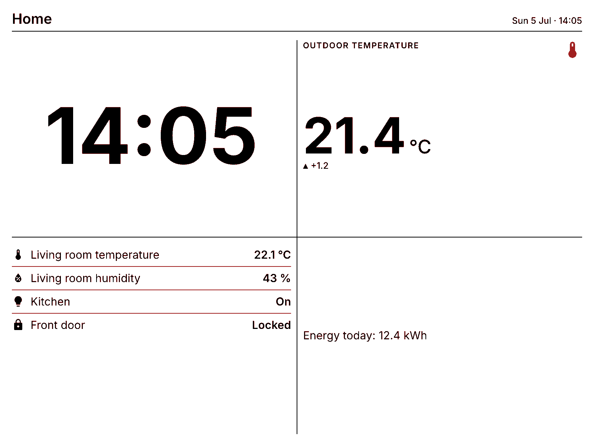
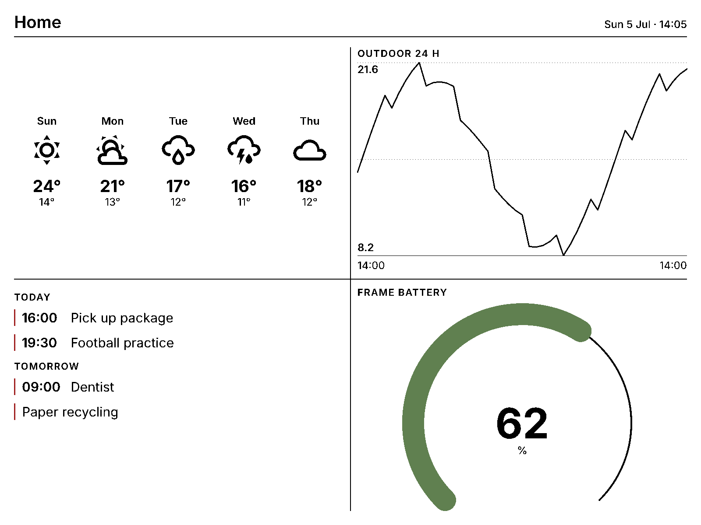

# Dashboard screens

[Back to the README](../README.md#dashboard-screens)

Render Home Assistant sensors, entity lists, and templated text as widgets in a
dashboard layout. The server draws vector graphics using the panel's six colours;
widget screens do not require a headless browser. Image widgets use the normal
image conversion pipeline.



This example combines a clock, sensor value, entity list, and template. Replace
the entity IDs with ones from your installation:

```yaml
action: fraimic.render_screen
data:
  screen:
    name: Home
    layout: quadrant          # full | half_horizontal | half_vertical | quadrant
    widgets:
      - type: clock
        slot: top_left
      - type: stat
        slot: top_right
        entity: sensor.outdoor_temperature
        icon: mdi:thermometer
        trend: true           # ▲/▼ + change vs 1 h ago (needs recorder)
      - type: entities
        slot: bottom_left
        entities:
          - sensor.living_room_temperature
          - sensor.living_room_humidity
          - light.kitchen
          - lock.front_door
      - type: template
        slot: bottom_right
        template: >-
          Energy today: {{ states('sensor.energy_today') }} kWh
```

Layouts define the slots: `full` (`main`), `half_horizontal` (`top`/`bottom`), `half_vertical`
(`left`/`right`), `quadrant` (`top_left`/`top_right`/`bottom_left`/`bottom_right`) — one widget
per slot. Empty slots stay blank.

## Widgets



| Type | What it shows | Key options |
|------|---------------|-------------|
| `clock` | Big HH:MM | `format` (strftime, no seconds) |
| `date` | Weekday + date | `format` (default `%A, %-d %B`) |
| `stat` | One big value + label + icon + optional trend arrow | `entity` (required), `name`, `icon`, `unit`, `precision`, `trend`, `trend_hours`, `color` |
| `entities` | Rows of name → state (with icons) | `entities` (list of ids or `{entity, name, icon}`), `max_rows` |
| `template` | Free-form Jinja-templated text | `template` (required), `align` (`left`/`center`), `size` (`s`/`m`/`l`) |
| `weather_current` | Condition icon + temperature + condition text | `entity` (weather, required), `name` |
| `weather_forecast` | Hourly/daily forecast strip (icon, high/low) | `entity` (required), `mode` (`hourly`/`daily`), `count` (1–8) |
| `calendar` | Agenda grouped by day (Today/Tomorrow/…) with accent bars | `entities` (calendar ids, required), `days` (1–14), `max_events` |
| `todo` | Checklist with checkboxes (strikethrough when done) | `entity` (todo, required), `max_items`, `show_completed` |
| `chart` | History line/area/bar chart from recorder data | `entities` (≤3, required), `hours` (1–168), `style`, `min`, `max`, `name` |
| `gauge` | 270° arc gauge with big value | `entity` (required), `min`, `max`, `unit`, `color`, `thresholds` (`[{from, color}]`) |
| `progress` | Labelled progress bar | `entity` (required), `min`, `max`, `name`, `color` |
| `image` | A photo / camera frame inside a slot (dithered) | `url` or `entity` (camera/image), `fit` (`cover`/`contain`) |

## Picture screens

`kind: picture` skips the widget renderer entirely and shows one image full-screen through the
normal photo pipeline (dithered + enhanced). Point it at any URL that returns an image — e.g. the
[puppet add-on](https://github.com/balloob/home-assistant-addons/tree/main/puppet), which
screenshots real Lovelace dashboards — or a camera/image entity:

```yaml
action: fraimic.render_screen
data:
  screen:
    kind: picture
    url: http://homeassistant.local:10000/lovelace/eink?viewport=1600x1200&kiosk
```

Screen-level options: `name` (shown in the header), `background` / `accent` / per-stat `color`
(one of `black`, `white`, `yellow`, `red`, `blue`, `green` — the panel's real palette),
`padding`, and `show_header: false` to drop the title bar. Icons are any
[Material Design Icon](https://pictogrammers.com/library/mdi/) (`mdi:...`), same names as
everywhere in HA.

## Managing screens in the UI

Screens can also be created **without any YAML**: on the frame's device page (Settings →
Devices & Services → Fraimic), choose **Add dashboard screen**. A short wizard asks for the
basics (name, layout, colours, rotation interval, optional time-of-day window) and then walks
through each slot with a widget picker and that widget's options — entity pickers, icon picker,
template editor, the lot. Screens are stored on the frame's config entry and can be edited or
deleted there later.

Show a stored screen by its name (or id) instead of an inline definition:

```yaml
action: fraimic.render_screen
data:
  screen_id: Gangen
```

(Gauge `thresholds` are the one option not exposed in the wizard — use the inline YAML form for
those.)

## Designing without burning refreshes

Every upload is a full ~30 s e-ink refresh and costs battery. Add `preview_only: true` to the
service call and the screen renders **only to the `Screen preview` image entity** — exactly what
the panel would show, including the 6-colour quantisation — so you can iterate on a design from
Developer Tools with zero uploads, then drop the flag when it's right.

Call `render_screen` from an automation with a time or state trigger to refresh
the dashboard. Choose an interval appropriate for a battery-powered e-ink frame;
every update can require a full redraw.
